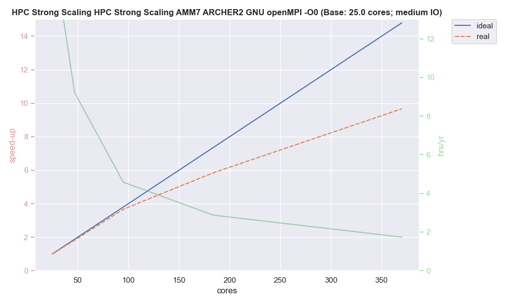
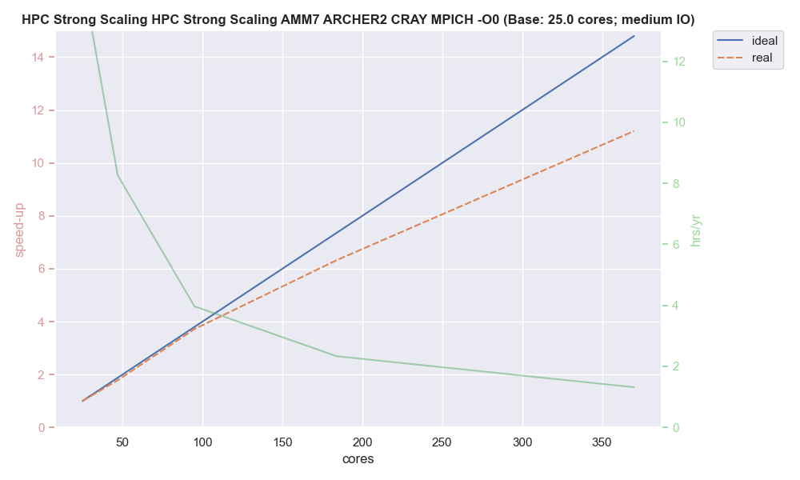
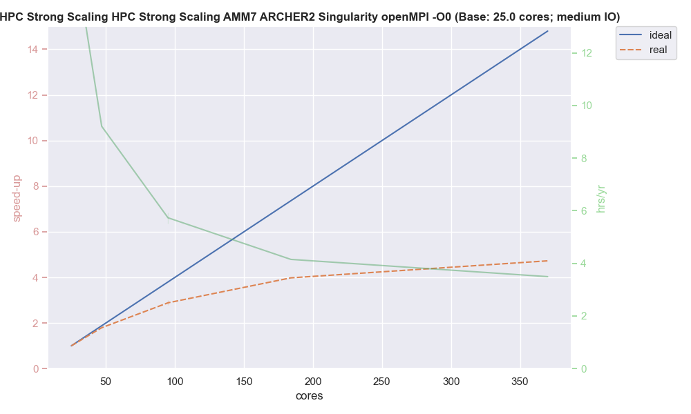

.. _performance:

===========
Performance
===========

In order to assess the performance of running on ARCHER2 ...

-------------
Scaling Tests
-------------

All standard output and hybrid MPI method unless otherwise stated

Bare-Metal

* GNU/openMPI O0
* GNU/openMPI O1
* Cray/MPICH  O0
* Cray/MPICH  O1 
* Cray/MPICH  O1 No Output / Heavy Output

SIF

* GNU/openMPI O0
* GNU/openMPI O1
* Cray/MPICH  O0
* Cray/MPICH  O1

Addtional SIF

* Cray/MPICH  O1 Bloated
* Cray/MPICH  O1 No Output / Heavy Output
* Cray/MPICH  O1 Bind MPI method

----------
Bare-metal
----------

Graphs + optimisations

--------
NEMO SIF
--------

Graphs + optimisations

-------
Summary
-------

Thoughts

- one
- two
- three
