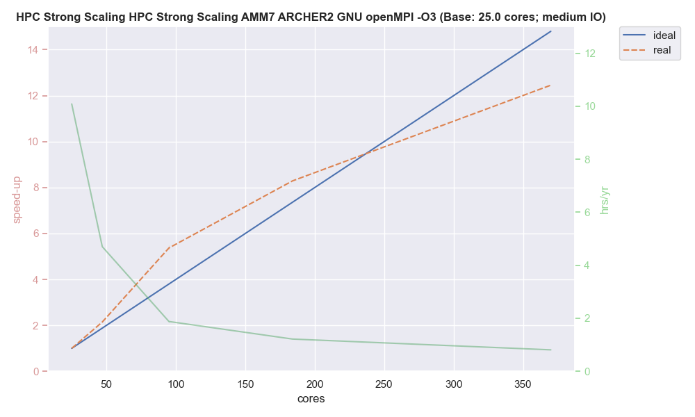

.. _performance:

===========
Performance
===========

Intro to running on ARCHER2 with refs

-------------
Scaling Tests
-------------

Summary here

----------
Bare-metal
----------

Graphs + optimisations

--------
NEMO SIF
--------

Graphs + optimisations

.. image:: _static/AMM7_scale1.png
   :width: 600

.. image:: _static/AMM7_scale2.png
   :width: 600

-------
Summary
-------

Thoughts

- one
- two
- three
